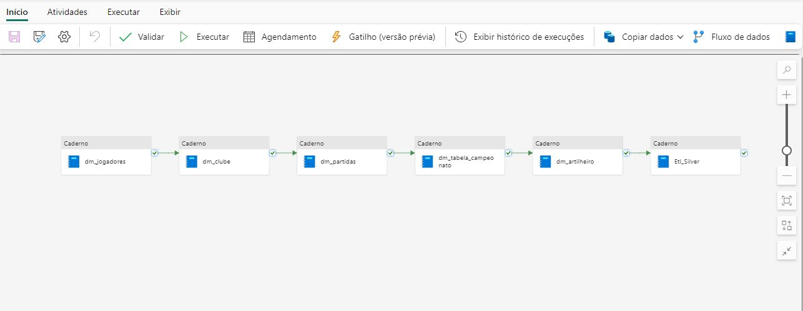
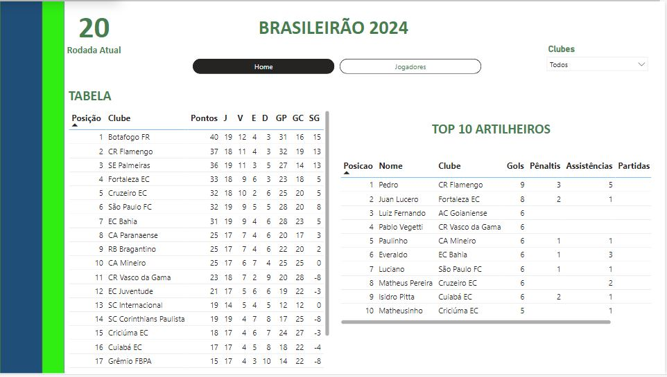
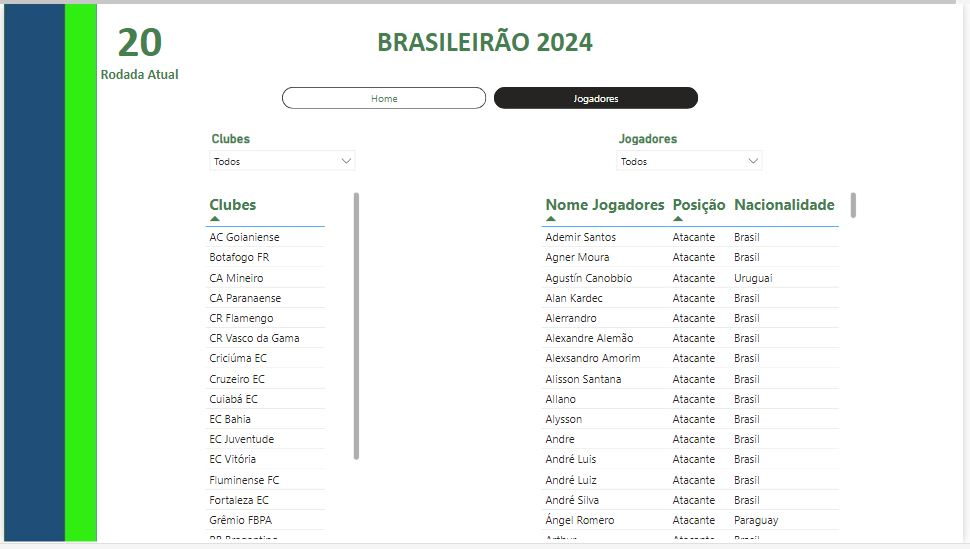

<h1 align="center">Análise Campeonato Brasileiro 2024</h1>

  

#### Índice

* [Descrição do projeto](#descrição-do-projeto)
* [Status do Projeto](#status-do-projeto)
* [Funcionalidade e demonstração da aplicação](#funcionalidade-e-demonstração-da-aplicação)
* [Tecnologia utilizadas](#tecnologia-utilizadas)
* [Melhorias Futuras](#melhorias-futuras)
* [Desenvolvedor do projeto](#desenvolvedor-do-projeto)

#### Descrição do projeto

Este projeto foi desenvolvido com o objetivo de realizar uma análise detalhada do Campeonato Brasileiro de 2024. Para isso, utilizamos a API [Football-data](https://www.football-data.org/), que foi consumida diretamente em um notebook dentro do ambiente de desenvolvimento do Fabric.

O processo de Extração, Transformação e Carga (ETL) dos dados foi inteiramente realizado utilizando Python, PySpark e Data Factory, garantindo eficiência e escalabilidade no tratamento dos dados. Após o processamento, os dados foram disponibilizados para visualização em um dashboard interativo, que permite a análise dinâmica de várias métricas do campeonato.

#### Status do Projeto

#### Funcionalidade e demonstração da aplicação

#### Tecnologia utilizadas
* [Python](https://www.python.org/downloads/)
* [Microsoft Fabric](https://app.fabric.microsoft.com/)
* [Pyspark](https://spark.apache.org/docs/latest/api/python/index.html)
* [Azure Data Factory](https://azure.microsoft.com/pt-br/products/data-factory)

### Melhorias Futuras

- [ ] Modelo preditivo de melhores jogadores na rodada;
- [ ] Probabilidade de vitoria dos times;
- [ ] Integração publicações dos setorista dos clubes. 

### Desenvolvedor do projeto
[ Vitor Souza ](https://github.com/vitorhssouza)

